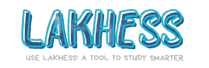
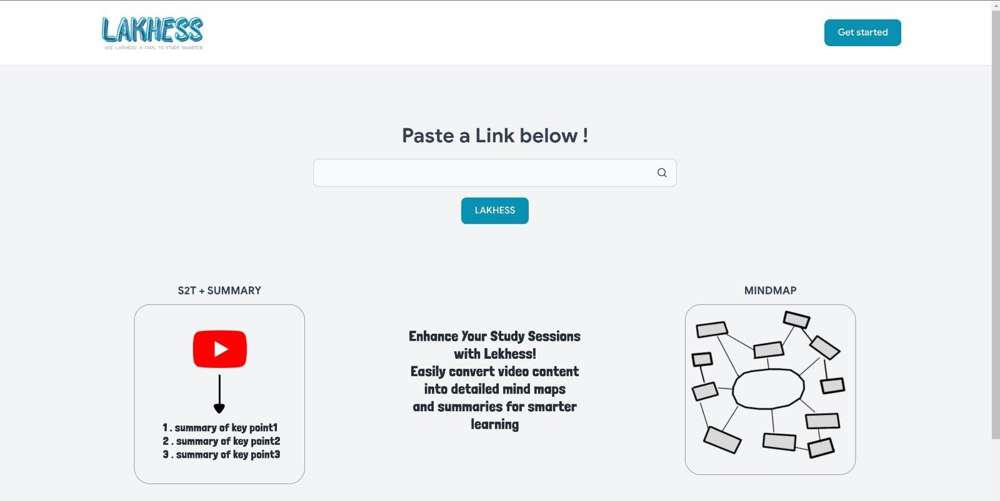
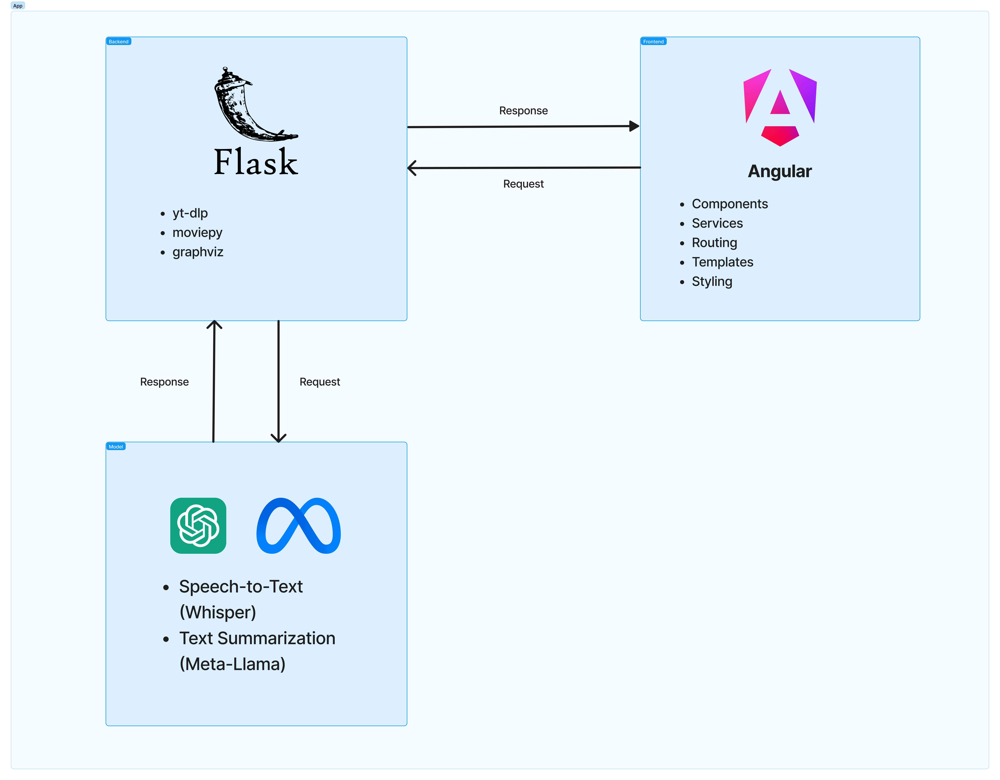

## Overview

Tired of spending hours binge-watching YouTube study videos assigned by your professors or seeking out videos yourself to reinforce class material? We understand how exhausting it can be!

Introducing **LAKHESS** – a tool designed to help you study smarter. LAKHESS is an AI-powered website that transforms your YouTube videos into a structured mind map and detailed summaries. Simply paste your YouTube link, click “LAKHESS!”, and watch as your content is converted into a visual map of topics and summaries, making study sessions more efficient and effective.

## Features

- **AI-Powered Mind Mapping**: Automatically generates a mind map of topics covered in the video.
- **Detailed Summaries**: Provides concise summaries for each topic to reinforce key points.
- **Easy to Use**: Simply paste the YouTube link and click to transform content.

   
## The Architecture

### General Overview

A visual representation of the project architecture:

### Used APIs

We utilized the following APIs:

1. **Meta-Llama (Meta-Llama-3-8B-Instruct)**
   - Purpose: Text summarization and generation
   - Provider: Meta AI
   - Documentation: [Meta-Llama Documentation](https://ai.meta.com/llama/)

2. **OpenAI Whisper**
   - Purpose: Speech-to-text conversion
   - Provider: OpenAI
   - Documentation: [Whisper GitHub](https://github.com/openai/whisper)

These APIs enable our application to perform advanced natural language processing tasks, including converting speech to text and generating concise summaries from textual input.

## Getting Started

1. **Paste the YouTube Link**: Enter the URL of the YouTube video you wish to analyze.
2. **Click “LAKHESS!”**: Let our AI process the video and generate the mind map and summaries.
3. **Review Results**: Explore the mind map and summaries to enhance your study sessions.

## Roadmap

- [x] Basic functionality
  - [x] Convert YouTube video to audio
  - [x] Audio to text using Whisper
  - [x] Summarize the text
  - [x] Generate mind map
  - [ ] Display the mind map in the frontend
- [x] User interface implementation and enhancement
- [ ] Add user authentication and profiles
- [ ] Implement save and share features for summaries and mind maps
- [ ] Optimize performance for longer videos
- [ ] Add support for multiple languages
- [ ] Implement advanced customization options for mind maps
- [ ] Add unit and integration tests

## Contact

**Salma Rachidi:**
General Engineering and Biotech Graduate

<a href="https://www.linkedin.com/in/salma-rachidi-5b7545282/">![LinkedIn][linkedin-shield]</a>
<a href="https://github.com/Gurerozu">![GitHub][github-shield]</a>

**Zineb EL HOUZ :**
Master's student in Data Science and Engineering

<a href="https://www.linkedin.com/in/zineb-el-houz/">![LinkedIn][linkedin-shield]</a>
<a href="https://github.com/zineb1224">![GitHub][github-shield]</a>

**Ahmed Houssam BOUZINE :**
Big Data & Cloud Computing Engineering Student 

<a href="https://www.linkedin.com/in/ahmed-houssam-bouzine/">![LinkedIn][linkedin-shield]</a>
<a href="https://github.com/AhmedHoussamBouzine">![GitHub][github-shield]</a>
<a href="https://ahmedhoussambouzine.com/">![Website][website-shield]</a>

[linkedin-shield]: https://img.shields.io/badge/-LinkedIn-0A66C2?style=flat&logo=linkedin&logoColor=white
[github-shield]: https://img.shields.io/badge/-GitHub-181717?style=flat&logo=github&logoColor=white
[website-shield]: https://img.shields.io/badge/-Website-4285F4?style=flat&logo=google-chrome&logoColor=white

